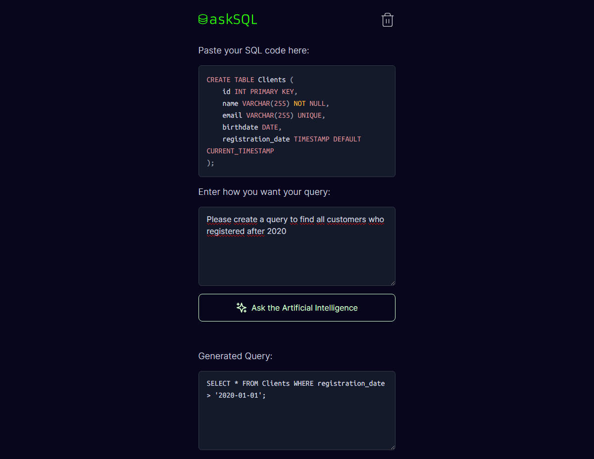

## AI-SQL-Query-Helper [:us: Video Tutorial](https://www.youtube.com/watch?v=5T5D4kfVNG8) | [:brazil: Video Tutorial](https://www.youtube.com/watch?v=vkOblTUN2MA)


<p align="center">
  

  

   <a href="https://github.com/GianDutra/AI-SQL-Schema-Assistant/commits/master">
    
  </a>
  
</p>

> Project developed as a challenge - Let's Code!

## Tech Stack

To create the website was used:

#### **Website**  ([NextJS](https://nextjs.org/)  + [React](https://reactjs.org/) + [TypeScript](https://www.typescriptlang.org/))

- **[OpenAI](https://platform.openai.com/)**
- **[Lucide React](https://phosphoricons.com/)**
- **[Tailwindcss](https://tailwindcss.com/)**
- **[Prismjs](https://prismjs.com/)**
- **[React Simple Code Editor](https://github.com/satya164/react-simple-code-editor)**
  
#### **API**
- **[GPT 3.5](https://platform.openai.com/)**

## 💻 Prerequisites
Before you start, make sure you have installed:

* [Node.js](https://nodejs.org/en/)
* [Git](https://git-scm.com)

## 🚀 Installing <AI-SQL-Schema-Assistant>

 
```bash

# Clone this repository
$ git clone https://github.com/GianDutra/AI-SQL-Schema-Assistant.git

# Access the project folder in your terminal
$ cd AI-SQL-Schema-Assistant

# Install the dependencies
$ npm install

# Run the application in developer mode
$ npm run dev

# The app will open by default on port: 3000 - go to http://localhost:3000/

```
#### Note: You must create a file in the project's root folder named '.env.local' and place your ChatGPT key to start using the program. (This key, after a certain number of messages, begins to incur charges on your credit card, so please be aware of this).
---


## 👨‍💼 Autor

<table>
  <tr>
    <td align="center">
      <a href="#">
        <br>
        <sub>
          <b>Gian Dutra</b>
        </sub>
      </a>
    </td>
  </tr>
</table>
